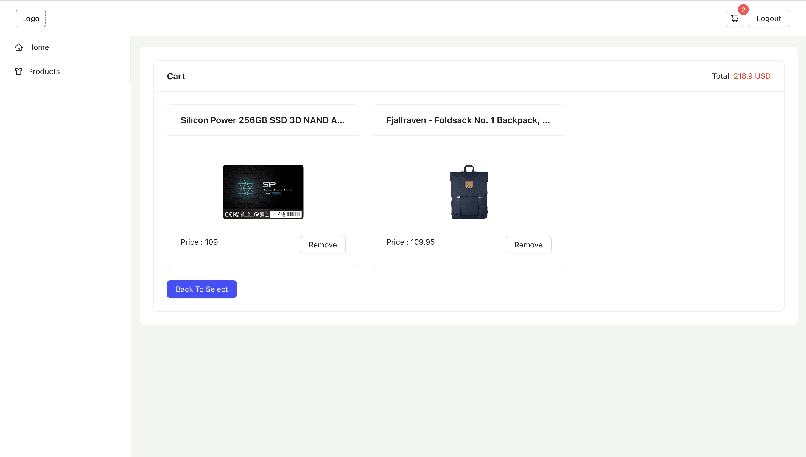
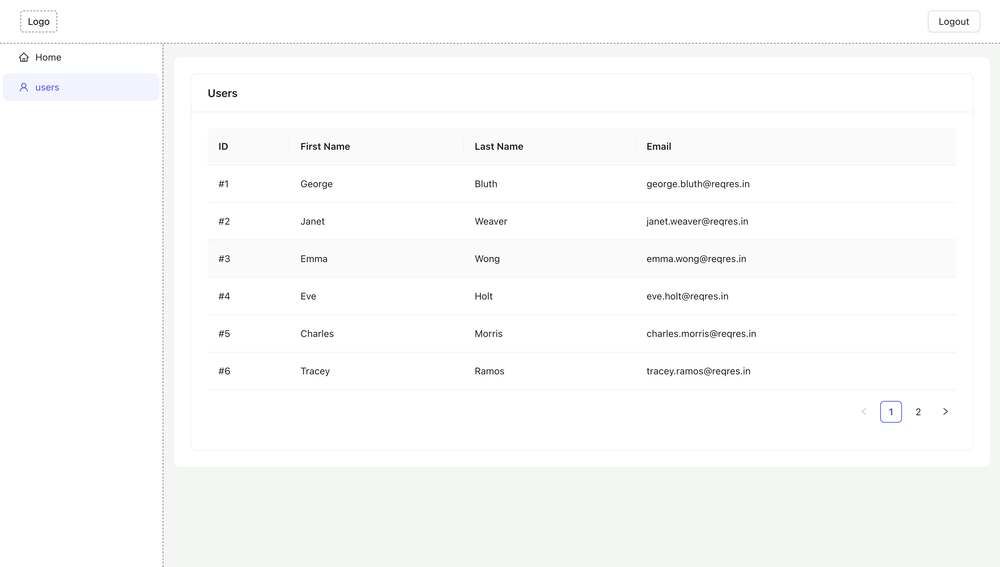

# CRUD APP , React + TypeScript + Vite + Antd

Install Typescript (skip if you already have it )

```bash
npm i -g typescript

```

Install `pnpm` (skip if you already have it )

```bash
npm i -g pnpm
```

Install packages

```bash
pnpm i
```

Run The project

```bash
pnpm run dev
```

---

## useful vscode extensions

```json
{
	"recommendations": [
		"esbenp.prettier-vscode",
		"antfu.icons-carbon",
		"streetsidesoftware.code-spell-checker",
		"naumovs.color-highlight",
		"eamodio.gitlens",
		"PKief.material-icon-theme",
		"antfu.where-am-i"
	]
}
```

## Demo

https://minimal-crud-project-react-ts.netlify.app

### Products


### Cart



### Create New Product


